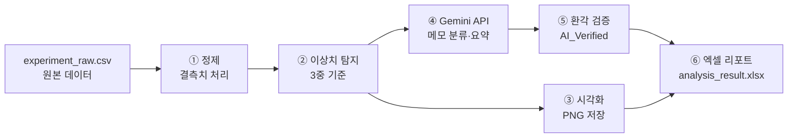
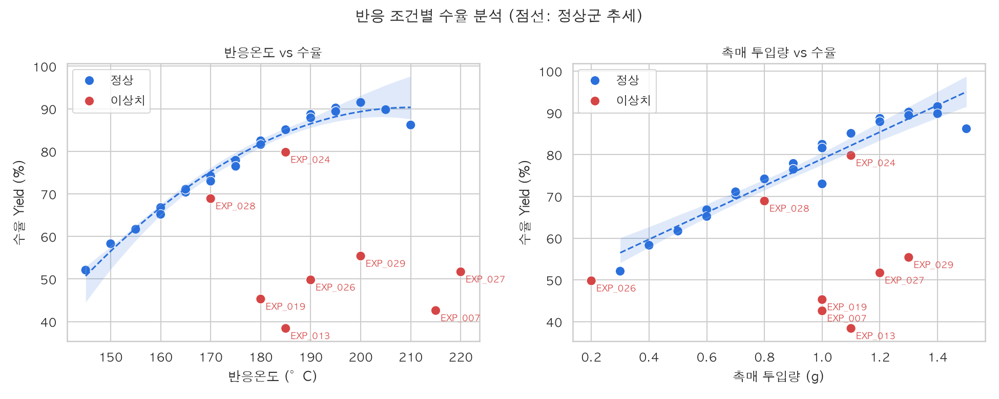

# 🧪 생성형 AI × Python 화학실험 데이터 정제 및 이상치 분석 자동화

> 반응기 실험 데이터(**정량 수치** + **서술형 특이사항 메모**)를
> **Python으로 정제·시각화**하고, **Gemini API로 이상 원인을 자동 분류·요약**한 뒤,
> **원본 데이터와 교차 검증**해서 **엑셀 리포트**로 만드는 미니 프로젝트입니다.

| 항목 | 내용 |
|---|---|
| 분야 | 화학공학 · 반응공학 · 공정 데이터 분석 |
| 사용 기술 | Python, Pandas, NumPy, Matplotlib, Seaborn, openpyxl, Google Gemini API, Flask |
| 핵심 성과 | 실험 데이터 정리 시간 **약 3시간 → 약 40분** (가정한 시나리오 기준) |
| 차별점 | AI 결과를 그대로 믿지 않고 **3단계 환각(Hallucination) 검증** 적용 |
| 실행 방식 | 터미널 스크립트 + **웹사이트** (파일 업로드·직접 입력 → 버튼 → 결과 표시) |

---

## 👀 한눈에 보는 프로젝트

> **화학 반응기 실험 데이터를 넣으면, 결측치 정리 → 이상 실험 찾기 → 이상 원인 분류(AI) → AI 답 검증 → 리포트 작성까지 자동으로 해 주는 프로그램**

### 무엇을 확인하나?

반응기 실험을 하면 숫자 데이터와 서술형 메모가 함께 쌓입니다.

| 실험 번호 | 온도 | 압력 | 촉매 | 시간 | 수율 | 순도 | 특이사항 메모 |
|---|---|---|---|---|---|---|---|
| EXP_006 | 190 | 2.2 | 1.2 | 100 | 88.7 | 97.5 | 정상 진행 |
| EXP_007 | 215 | 2.3 | 1.0 | 90 | **42.6** | 84.3 | 온도 오버슈트 발생해서 생성물 분해 |

이 데이터로 아래 **5가지 질문**에 답합니다.

| # | 질문 | 확인하는 것 |
|---|---|---|
| ① | 데이터에 빠진 값은 없나? | 결측치 위치와 개수 |
| ② | 결과가 비정상인 실험은 무엇인가? | 이상치 실험 찾기 |
| ③ | 왜 수율이 떨어졌나? | 이상 원인 분류: 촉매 문제, 온도 이상, 압력 누출, 기타 |
| ④ | 어떤 조건에서 수율이 좋은가? | 온도·촉매량과 수율의 관계 |
| ⑤ ⭐ | **AI가 내린 판단을 믿어도 되는가?** | **AI 답을 원본 데이터와 자동 대조** |

### 무엇을 구현했나? (처리 순서대로)

| 단계 | 하는 일 | 핵심 포인트 |
|---|---|---|
| **① 데이터 정제** | 빈 칸 처리 | 운전조건은 **중앙값**으로 채움. 수율은 결과값이라 **채우지 않고 분석에서 제외**. 무엇을 채웠는지 기록하고 원본도 보관 |
| **② 이상치 탐지** | 3가지 기준으로 판정 | **운전범위 이탈** + **수율 통계(IQR)** + **연구자의 `[이상치]` 표기**. 지우지 않고 표시만 함 |
| **③ 통계·그래프** | 평균, 상관계수, 산점도 | 추세선은 **정상 실험만으로** 그려 왜곡을 막음 |
| **④ AI 원인 분류** | Gemini가 메모를 읽고 분류·요약 | 5개 카테고리 중에서만 고르고, **기록에 없는 원인은 지어내지 말라**는 규칙을 프롬프트에 넣음 |
| **⑤ 환각 검증** ⭐ | AI 답을 원본과 자동 대조 | 규칙 분류와 다르거나, `[이상치]` 표기와 모순되거나, 원본에 없는 숫자가 나오면 **"검토 필요"**로 표시 |
| **⑥ 리포트** | 엑셀 5개 시트 | 정제 데이터, 통계, 원인별 요약, 결측치, 원본 |
| **⑦ 웹사이트** | 브라우저에서 실행 | 파일 업로드/직접 입력 → 분석 버튼 → 결과가 아래에 표시 → 엑셀 다운로드 |
| **⑧ 안전장치** | 실패해도 멈추지 않음 | API 키 없음 → 규칙 분류 / 서버 혼잡 → 재시도·보조 모델 / SSL 오류 → OS 인증서 사용 |

> 🚨 **실제로 잡아낸 사례:** 압력이 운전범위(3.0 bar)를 넘은 **EXP_028**을 AI가 '정상'으로 판정했는데, 검증 단계가 이를 **"검토 필요"**로 잡아냈습니다.
> 사람은 30건을 다 볼 필요 없이 **표시된 1~2건만 확인**하면 됩니다.

### 전체 흐름

```
데이터 입력 (CSV · 엑셀 · 화면에서 직접 입력)
   ↓
① 정제 ──→ ② 이상치 탐지 ──→ ③ 통계 · 그래프
                  ↓
           ④ AI 원인 분류 (Gemini)
                  ↓
           ⑤ 환각 검증 → "검토 필요" 표시
                  ↓
           ⑥ 엑셀 리포트  +  ⑦ 웹 화면
```

### 무엇을 AI에게 맡기고, 무엇을 맡기지 않았나?

| 작업 | 담당 | 이유 |
|---|---|---|
| 계산, 범위 판정, 통계 | 🐍 **Python** | 정답이 정해져 있어서 AI보다 정확합니다 |
| 서술형 메모 해석 | 🤖 **AI** | 사람마다 표현이 달라서 규칙만으로는 어렵습니다 |
| 최종 판단 | 👩‍🔬 **사람** | "검토 필요"로 표시된 행만 확인합니다 |

> 💬 **"AI는 초안을 만들고, 검증은 코드가 하고, 최종 판단은 엔지니어가 합니다."**

### 이 프로젝트로 보여 줄 수 있는 역량

| 역량 | 근거 |
|---|---|
| 데이터 분석 | 결측치 처리 원칙, 3중 이상치 기준, 통계 |
| 화학공학 이해 | 운전범위, 수율·순도, 온도 오버슈트·촉매 불활성화·누출 같은 공정 문제 |
| 생성형 AI 활용 | 프롬프트 설계, API 연동 |
| **AI를 비판적으로 쓰는 능력** | 환각 검증 설계와 실제로 오류를 잡아낸 사례 |
| 문제 해결 | SSL, 503, 404 오류를 원인부터 찾아서 해결 |
| 안전 설계 | 실패해도 멈추지 않는 단계별 안전장치 (공정의 **이중화 설계**와 같은 생각) |

> ⚠️ **꼭 기억하세요.** 데이터는 **가상**입니다. "200 °C가 최적"이라는 결론은 실제로 발견한 것이 아니라, 데이터를 그렇게 설계한 결과입니다.
> 이 프로젝트에서 보여 주는 것은 **결과가 아니라 방법**입니다. 실험 데이터를 체계적으로 처리하는 방법, 그리고 AI를 검증하면서 쓰는 방법입니다.
> 학교 실험 데이터를 넣어서 돌려 보면 **"실제 데이터에 적용했다"**고 말할 수 있어서 훨씬 강한 경험이 됩니다.

---

## 📌 목차
1. [프로젝트 배경](#1-프로젝트-배경)
2. [파이프라인 구조](#2-파이프라인-구조)
3. [디렉토리 구조와 데이터](#3-디렉토리-구조와-데이터)
4. [실행 방법](#4-실행-방법)
5. [분석 결과](#5-분석-결과)
6. [핵심 설계 포인트](#6-핵심-설계-포인트)
7. [면접 대비 Q&A](#7-면접-대비-qa)
8. [자소서 활용 예시](#8-자소서-활용-예시)
9. [한계와 개선 방향](#9-한계와-개선-방향)

---

## 1. 프로젝트 배경

### 😩 문제
반응기 실험을 하고 나면 실험 노트에는 온도·압력·촉매량·수율 같은 **숫자 데이터**와
"온도 오버슈트 발생", "촉매 불활성화 의심" 같은 **서술형 메모**가 섞여서 쌓입니다.
이걸 정리하는 일은 전부 손으로 해야 했습니다.

| 기존 수작업 | 소요 시간 |
|---|---|
| 엑셀에서 결측치·오기입 찾기 | 약 40분 |
| 이상 실험을 골라내고 메모를 하나씩 읽으며 원인 분류 | 약 80분 |
| 그래프 그리기, 통계 정리 | 약 40분 |
| 보고서 양식으로 옮기기 | 약 20분 |
| **합계** | **약 3시간** |

### 💡 해결
| 단계 | 자동화 내용 | 도구 |
|---|---|---|
| ① 정제 | 결측치 탐지 → 운전조건은 **중앙값**으로 대체, 수율은 **대체하지 않고 분석에서 제외** | Pandas |
| ② 이상치 탐지 | **운전범위 이탈 + 수율 IQR + 연구자의 `[이상치]` 표기**, 3중 기준 | Pandas, NumPy |
| ③ 시각화 | 온도·촉매량 vs 수율 산점도와 **정상 데이터로만 그린 추세선** | Matplotlib, Seaborn |
| ④ AI 분류 | 메모를 5개 카테고리로 분류하고 원인을 1문장으로 요약 | Gemini API |
| ⑤ 환각 검증 | 규칙 분류·원본 표기·원본 수치와 대조해 `AI_Verified` 판정 | Python |
| ⑥ 리포트 | 시트 5개짜리 엑셀, 이상치·검증 실패 행은 색으로 강조 | openpyxl |

### ✅ 결과
**약 3시간 걸리던 작업이 약 40분으로 줄었습니다.**
스크립트 실행은 1분도 안 걸리고, 남은 시간은 **AI 검증에서 걸러진 행만 사람이 검토하고 결론을 쓰는 데** 씁니다.

> ⚠️ **면접 전 꼭 확인하세요.** 시간 단축 수치(3시간 → 40분)와 실험 데이터는 이 프로젝트를 위해 설정한 **가상 시나리오**입니다.
> 면접에서는 "실험 데이터 정리를 가정하고 직접 만든 미니 프로젝트"라고 솔직하게 말하는 것이 안전합니다.
> 실제로 경험한 수치가 있다면 그 수치로 바꿔서 쓰세요.

---

## 2. 파이프라인 구조



`src/analyzer.py`의 `main()` 함수가 위 순서대로 함수를 호출합니다.

| 함수 | 역할 |
|---|---|
| `load_api_key()` | `.env`에서 API 키를 읽음. 없으면 안내 메시지를 띄우고 오프라인 모드로 진행 |
| `load_and_clean()` | CSV 로드, 결측치 처리, 3중 이상치 판정 |
| `summarize()` | 기초 통계, 이상치 제외 평균, 수율과의 상관계수 |
| `make_plot()` | 그래프 생성 (한글 폰트 자동 설정) |
| `apply_ai_analysis()` | Gemini 분류 → 실패하면 규칙 기반으로 대체 → 환각 검증 |
| `save_excel()` | 엑셀 저장, 서식 적용 (헤더 색, 열 너비, 강조 색) |

---

## 3. 디렉토리 구조와 데이터

```
suhw/
├── data/
│   └── experiment_raw.csv      # 가상 반응기 실험 데이터 30행
├── src/
│   └── analyzer.py             # 전체 파이프라인 스크립트 (터미널·웹 공용)
├── web/
│   ├── app.py                  # 웹사이트 서버 (Flask)
│   ├── templates/index.html    # 화면 구조
│   └── static/                 # 화면 디자인(style.css)과 동작(app.js)
├── output/
│   ├── yield_analysis_plot.png # 온도·촉매량 vs 수율 그래프
│   └── analysis_result.xlsx    # 최종 분석 리포트
├── .env.example                # API 키 템플릿
├── .gitignore                  # .env 등 Git 제외 목록
├── requirements.txt            # 필요 패키지
└── README.md
```

### 컬럼 설명

| 컬럼 | 의미 | 범위 |
|---|---|---|
| `Experiment_ID` | 실험 번호 | EXP_001 ~ EXP_030 |
| `Temp_C` | 반응온도 (°C) | 140 ~ 220 |
| `Pressure_bar` | 반응압력 (bar) | 1.0 ~ 3.0 |
| `Catalyst_g` | 촉매 투입량 (g) | 0.2 ~ 1.5 |
| `Reaction_Time_min` | 반응시간 (분) | 30 ~ 120 |
| `Yield_pct` | 수율 (%) | 40 ~ 95 |
| `Purity_pct` | 순도 (%) | 80 ~ 99 |
| `Notes` | 실험 특이사항 메모 | 자유 서술 |

### 데이터에 일부러 넣어 둔 문제

| 유형 | 실험 ID | 내용 |
|---|---|---|
| 결측치 | EXP_005, 011, 016, 022, 025 | 압력, 수율, 촉매량, 메모, 온도가 각각 빠져 있음 |
| 온도 이상 | EXP_007, 027 | 온도 오버슈트로 생성물 분해, 냉각 실패로 인한 열폭주 징후 |
| 촉매 문제 | EXP_013, 026 | 촉매 불활성화, 촉매 계량 오류 |
| 압력 누출 | EXP_019, 029 | 가스켓 누출, 밸브 미세 누출 |
| 기타 | EXP_024, 028 | 원료에 수분 혼입, 압력계 교정 불량(3.4 bar로 운전범위 초과) |

> 모든 데이터는 학습용으로 만든 **가상 값**입니다.

---

## 4. 실행 방법

### 1단계. 가상환경 만들기 (권장)
```bash
python3 -m venv .venv
source .venv/bin/activate        # Windows: .venv\Scripts\activate
```

### 2단계. 패키지 설치
```bash
pip install -r requirements.txt
```

### 3단계. API 키 설정
```bash
cp .env.example .env             # Windows: copy .env.example .env
```
`.env` 파일을 열어 `GEMINI_API_KEY=` 뒤에 본인이 발급받은 키를 넣습니다.
키는 [Google AI Studio](https://aistudio.google.com/app/apikey)에서 무료로 발급받을 수 있습니다.

#### `.env` 파일 여는 방법
이름이 `.`으로 시작하는 파일은 **숨김 파일**이라 Finder에 바로 보이지 않습니다. 아래 방법 중 편한 것을 쓰세요.

| 방법 | 하는 법 |
|---|---|
| **터미널 + 텍스트 편집기** (가장 쉬움) | `open -e .env` → 텍스트 편집기가 열림 |
| **VS Code** | `code .env` 또는 VS Code에서 프로젝트 폴더를 열고 왼쪽 목록에서 `.env` 클릭 |
| **Finder** | 프로젝트 폴더에서 `Cmd + Shift + .` → 숨김 파일이 보임 → `.env`를 텍스트 편집기로 열기 |
| **Windows** | `notepad .env` |

파일을 열면 아래 줄을 찾아서 수정하고 저장합니다.
```
GEMINI_API_KEY=your_gemini_api_key_here     ← 수정 전
GEMINI_API_KEY=발급받은_본인_키              ← 수정 후 (따옴표·공백 없이)
```
> 🔒 `.env`에는 본인 키가 들어가므로 **카톡·메일·Git으로 공유하지 마세요.** 다른 사람에게 줄 때는 `.env.example`만 줍니다.

### 4단계. 실행
```bash
python src/analyzer.py
```

### 실행 화면 예시
```
[1] 원본 데이터 로드: 30행 x 8열
    수율 IQR 하한: 18.1%  |  이상치 판정: 8건
[2] 기초 통계 요약 완료
[3] 그래프 저장: output/yield_analysis_plot.png
[4] Gemini API 호출 중... (30건 일괄 처리)
    응답 성공 (model=gemini-3.5-flash-lite)
    AI 분류 완료 (source: Gemini (gemini-3.5-flash-lite)) | 검증 불일치: 2건 → 엑셀에서 수동 검토 필요
[5] 엑셀 리포트 저장: output/analysis_result.xlsx
완료! output/ 폴더에서 결과를 확인하세요.
```

### 알아두면 좋은 점
- 🔌 **API 키가 없어도 실행됩니다.** 안내 메시지를 띄우고 키워드 규칙 분류로 바꿔서 끝까지 진행합니다.
- 🔁 구글 서버가 붐빌 때(503·429 오류)는 2초 뒤 한 번 더 시도하고, 그래도 안 되면 **보조 모델(`gemini-flash-lite-latest` → `gemini-3.1-flash-lite`)**로 차례대로 넘어갑니다. 모델이 없어졌을 때(404)는 바로 다음 모델로 넘어갑니다.
- 🛟 그래도 실패하면(네트워크 문제, 인증 오류, 응답 파싱 실패) 규칙 기반으로 자동 전환됩니다.
- 🏢 **회사망 SSL 대응:** 회사 보안 프록시가 있는 네트워크에서는 `CERTIFICATE_VERIFY_FAILED` 오류가 날 수 있습니다. 그래서 `truststore`로 **맥 키체인·Windows 인증서 저장소**의 인증서를 쓰게 했습니다. (SSL 검증을 끄는 방식은 보안상 위험해서 쓰지 않았습니다.)
- ⚙️ 모델은 `.env`의 `GEMINI_MODEL`로 바꿀 수 있습니다. 기본값은 **`gemini-3.5-flash-lite`**입니다.
  - **Lite 모델을 고른 이유:** 일반 Flash 모델은 사용자가 몰려 503 오류가 자주 났고, Lite 모델은 매번 1~2초 안에 응답했습니다. 5개 카테고리 분류와 1문장 요약은 Lite 모델로도 충분합니다.
  - **버전을 고정한 이유:** 실행할 때마다 같은 모델을 써야 결과를 비교하고 재현할 수 있습니다. 이 모델이 서비스 종료되면 보조 모델로 자동 전환됩니다.
- 🔒 `.env`는 `.gitignore`에 들어 있어서 Git에 올라가지 않습니다. **API 키를 코드에 직접 쓰지 마세요.**

### 자주 생기는 문제
| 증상 | 해결 방법 |
|---|---|
| `ModuleNotFoundError` | 가상환경을 켰는지 확인한 뒤 `pip install -r requirements.txt` 다시 실행 |
| 그래프의 한글이 □□로 깨짐 | Windows는 맑은 고딕, Mac은 AppleGothic을 자동으로 씀. Linux는 나눔고딕 설치 필요 |
| `[오류] ... 파일이 열려 있습니다` | 엑셀에서 `analysis_result.xlsx`를 닫고 다시 실행 |
| `CERTIFICATE_VERIFY_FAILED: self signed certificate` | 회사·학교망의 보안 프록시 때문입니다. `pip install -r requirements.txt`로 `truststore`가 설치됐는지 확인하세요. 그래도 안 되면 집 와이파이나 핫스팟으로 실행해 보세요. |
| `503 UNAVAILABLE` (high demand) | 구글 서버가 일시적으로 붐비는 상태입니다. 코드가 자동으로 재시도하고 보조 모델로 넘어갑니다. 계속 실패하면 몇 분 뒤 다시 실행하세요. |
| `404 NOT_FOUND` (model is no longer available) | 서비스가 끝난 모델 이름입니다. `.env`의 `GEMINI_MODEL`을 `gemini-3.5-flash-lite`로 바꾸세요. (코드가 보조 모델로 자동 전환하기도 합니다.) |
| `400 API key not valid` | `.env`의 키를 다시 복사해서 넣으세요. 앞뒤 공백이나 따옴표가 없어야 합니다. |
| `All support for the google.generativeai package has ended` | 옛 패키지 경고입니다. 이 프로젝트는 새 패키지 `google-genai`를 씁니다. `pip uninstall google-generativeai` 후 `pip install -r requirements.txt` |

---

### 🌐 웹사이트로 실행하기

터미널 대신 **브라우저 화면에서 데이터를 넣고 버튼으로 분석**할 수 있습니다.

```bash
cd ~/Desktop/suhw && source .venv/bin/activate && python web/app.py
```
실행한 뒤 브라우저에서 **http://127.0.0.1:5050** 에 접속합니다. 종료할 때는 터미널에서 `Ctrl + C`를 누릅니다.

| 단계 | 화면에서 하는 일 |
|---|---|
| **① 데이터 넣기** | CSV/엑셀 파일을 끌어다 놓기, **샘플 데이터 불러오기**, **빈 표로 직접 입력** 중 하나를 고릅니다. 입력 양식(CSV)도 내려받을 수 있습니다. |
| **② 확인·수정** | 불러온 데이터가 표로 나옵니다. 칸을 클릭해 고치고, 행을 추가하거나 삭제할 수 있습니다. 빗금 친 빈 칸은 결측치로 처리됩니다. |
| **③ 분석 실행** | **분석 실행** 버튼을 누르면 바로 아래에 결과가 나옵니다. Gemini 스위치를 끄면 키워드 규칙으로만 분류합니다(외부 전송 없음). |
| **결과 확인** | 요약 숫자 4개, 수율 그래프, 원인별 평균 수율, 결측치 현황, 실험별 상세 결과(전체·이상치·검토 필요 필터), 기초 통계를 보여 주고 **엑셀 리포트를 다운로드**할 수 있습니다. |

**입력 방식을 이렇게 정한 이유**
- 실험 데이터는 보통 엑셀로 이미 정리돼 있어서 **파일 업로드를 기본**으로 했습니다. 손으로 30행을 치면 오타가 나기 쉽습니다.
- 대신 업로드한 내용도 **화면 표에서 바로 고칠 수 있게** 해서, 몇 개만 고치거나 추가할 때는 직접 입력하면 됩니다.
- `온도`, `수율`, `특이사항` 같은 **한글 컬럼명**과, 한글 엑셀에서 저장한 CSV(cp949)도 알아서 인식합니다.

**화면 디자인**
- 밝은 배경에 **초록 + 회색 계열만** 씁니다.
- 이상치는 색만으로 구분하지 않고 **✕ 모양과 "이상치" 배지**로도 표시해서, 색을 구분하기 어려운 사람도 알아볼 수 있습니다.

**보안**
- 서버는 `127.0.0.1`에서만 열려서 **내 컴퓨터에서만 접속**할 수 있습니다.
- API 키는 서버에만 있고 브라우저로는 전달되지 않습니다.

---

## 5. 분석 결과

### 📈 수율 분석 그래프



- 🔵 파란 점: 정상 실험 / 🔴 빨간 점: 이상치 (실험 번호 표시)
- 점선: **정상 데이터만으로** 그린 추세선 (온도는 2차 곡선, 촉매량은 직선)

### 🔍 이렇게 해석할 수 있습니다
1. **온도:** 수율이 온도에 따라 올라가다가 **약 200~205 °C에서 최대**가 되고, 그보다 높아지면 줄어드는 경향을 보입니다.
2. **촉매량:** 촉매를 많이 넣을수록 수율이 꾸준히 올라갑니다.
3. **이상치:** 빨간 점 대부분은 운전조건이 정상 범위인데도 수율이 40~55%로 떨어져 있습니다. **조건 문제가 아니라 설비나 운전 문제**였다는 뜻입니다.

### 📊 원인 카테고리별 요약 (엑셀 `AI_Category_Summary` 시트)

| 카테고리 | 건수 | 평균 수율 | 평균 순도 |
|---|---|---|---|
| 정상 | 20 | 76.7% | 95.2% |
| 촉매 문제 | 2 | 44.1% | 89.9% |
| 온도 이상 | 2 | 47.2% | 85.1% |
| 압력 누출 | 2 | 50.4% | 87.9% |
| 기타 | 3 | 78.3% | 90.1% |

※ 수율이 없는 EXP_011은 집계에서 뺐습니다.
※ 위 표는 **사람이 검토를 마친 뒤**의 결과입니다. Gemini가 처음 분류했을 때는 EXP_023, EXP_028을 '정상'으로 넣어서 정상 22건, 기타 1건이었습니다. 아래 [실제 검증 사례](#-실제-검증-사례-ai-오류를-잡아낸-경우)를 참고하세요.

→ 이상 실험 3종의 평균 수율은 정상 대비 **약 26~33%p 낮습니다.**
→ **온도 이상**일 때 순도가 가장 많이 떨어집니다(85.1%). 생성물이 분해되고 부반응이 늘어난 결과로 볼 수 있습니다.

### 📁 엑셀 리포트 구성 (`output/analysis_result.xlsx`)

| 시트 | 내용 |
|---|---|
| `Cleaned_Data` | 정제된 데이터 + `AI_Category`, `AI_Cause_Summary`, `AI_Verified`, `Verify_Note`<br/>🟥 이상치 행 / 🟨 검증 실패 칸 |
| `Summary_Stats` | 기초 통계, 이상치 제외 평균, 수율과의 상관계수 |
| `AI_Category_Summary` | 카테고리별 건수와 평균 수율·순도 |
| `Missing_Report` | 컬럼별 결측치 개수와 비율 |
| `Raw_Data` | 손대지 않은 원본 (추적성 확보) |

### 🤖 AI 분류 결과 예시

| 실험 ID | 원본 메모 | AI_Category | AI_Cause_Summary |
|---|---|---|---|
| EXP_007 | [이상치] 반응기 내부 온도 오버슈트 25도 발생하여 생성물 분해 | 온도 이상 | 온도 오버슈트로 생성물이 분해되어 수율이 떨어짐 |
| EXP_013 | [이상치] 촉매 불활성화로 수율 급감 (재사용 촉매 3회차) | 촉매 문제 | 재사용 촉매의 활성이 떨어져 수율이 급감함 |
| EXP_019 | [이상치] 압력 누출로 인한 미반응물 잔류 | 압력 누출 | 압력 누출로 반응이 덜 진행되어 미반응물이 남음 |
| EXP_025 | 온도 로거 통신 오류로 온도 기록 누락. 반응은 정상 | 정상 | 특이사항 없음 |

> EXP_025는 메모에 "온도"라는 단어가 있지만 **반응 자체는 정상**이고 기록만 빠진 경우입니다.
> 단어만 보고 분류하면 '온도 이상'으로 잘못 들어가기 쉬워서, 프롬프트와 규칙에 이 경우를 따로 명시했습니다.
> (요약 문장은 Gemini 응답에 따라 실행할 때마다 조금씩 달라질 수 있습니다.)

### 🚨 실제 검증 사례: AI 오류를 잡아낸 경우

실제로 Gemini를 호출해 보니 **30건 중 2건에서 `AI_Verified = False`**가 나왔습니다.

| 실험 ID | 원본 메모 | 원본 수치 | Gemini 판정 | 검증 결과 |
|---|---|---|---|---|
| EXP_028 | 압력계 교정 불량 의심. 실제 압력 재확인 필요 | 압력 **3.4 bar** (운전범위 1.0~3.0 초과) | **정상** ❌ | 규칙분류(기타)와 불일치 → 🟨 |
| EXP_023 | 고온 장시간 반응으로 부반응 소폭 증가 | 210 °C, 120분 | **정상** ❌ | 규칙분류(기타)와 불일치 → 🟨 |

- **EXP_028:** 메모에 `[이상치]` 표시가 없어서 AI는 정상으로 봤습니다. 하지만 압력이 **운전범위를 넘었고** 압력계 자체를 믿기 어려운 상황이라, **'정상'으로 두면 안 되는 데이터**입니다.
- **EXP_023:** 부반응이 늘었다는 기록이 있어서 순도 관리 측면에서 **따로 지켜봐야 할 실험**입니다.

> 📝 **같은 데이터로 여러 번 돌려도 결과가 조금씩 다릅니다.** `temperature=0.1`로 낮춰도 3번 중 1번은 Gemini가 EXP_028을 '기타'로 맞게 분류해서 불일치가 1건만 나왔습니다. **AI 결과는 실행마다 흔들릴 수 있기 때문에, 매번 자동으로 검증하는 단계가 꼭 필요합니다.**

👉 **AI는 메모 문장만 보고 "큰 문제는 아니다"라고 판단했지만, 원본 수치와 대조하는 검증 단계가 이를 잡아냈습니다.**
사람은 30건을 다 볼 필요 없이 **노란색 2건만 확인**하면 됐습니다. 이 프로젝트에서 검증 설계가 왜 필요한지를 보여 주는 **가장 좋은 면접 사례**입니다.

---

## 6. 핵심 설계 포인트

| # | 설계 | 이유 |
|---|---|---|
| 1 | **수율은 결측 대체를 하지 않음** | 온도·압력 같은 운전조건은 중앙값으로 채워도 되지만, 수율은 **결과값**이라 채우면 데이터를 지어내는 셈입니다. 그래서 `Use_For_Analysis=False`로 표시하고 분석에서 뺐습니다. |
| 2 | **중앙값으로 대체** | 이상치가 섞여 있으면 평균은 한쪽으로 끌려갑니다. 중앙값은 그 영향을 덜 받습니다. |
| 3 | **이상치는 지우지 않고 표시만** | 이상치에 공정 문제의 신호가 담겨 있습니다. 추세 분석에서만 빼고, 원인 분석에는 핵심 데이터로 씁니다. |
| 4 | **정상 데이터로만 추세선** | 이상치를 넣으면 추세가 왜곡되어 최적 조건을 잘못 읽게 됩니다. |
| 5 | **API는 한 번만 호출** | 30건을 한 요청에 묶어 보내 비용과 시간을 줄였습니다. `temperature=0.1`과 JSON 출력 강제로 응답이 매번 흔들리지 않게 했습니다. |
| 6 | **원본 보존과 이력 기록** | 보정한 값은 `Data_Flag`에 기록하고 원본은 `Raw_Data` 시트에 따로 남겨서, 언제든 원래 값으로 거슬러 올라갈 수 있습니다. |
| 7 | **실패해도 멈추지 않음** | API 키가 없거나 호출이 실패해도 규칙 기반으로 바꿔서 리포트는 반드시 만들어집니다. |

---

## 7. 면접 대비 Q&A

### Q1. 어떤 도구를 사용했나요?

> **💬 답변 예시**
>
> Python을 기반으로 **Pandas**로 데이터 정제와 통계를 처리했고, **Matplotlib·Seaborn**으로 시각화했습니다.
> 서술형 메모 분류에는 **Google Gemini API**를, 엑셀 리포트에는 **openpyxl**을 썼습니다.
>
> 도구마다 역할을 확실히 나눈 것이 핵심입니다.
> 계산이나 범위 판정처럼 **정답이 정해진 일은 Pandas**가 맡고,
> 사람이 직접 읽어야 했던 **서술형 메모 해석만 AI**에 맡겼습니다.
> 숫자 계산까지 AI에 맡기면 틀려도 알아채기 어렵기 때문입니다.

**🔑 키워드:** 역할 분담 · 정량은 코드로, 정성은 AI로

---

### Q2. AI 환각(Hallucination)은 어떻게 검증했나요?

> **💬 답변 예시**
>
> AI가 그럴듯하게 틀릴 수 있다는 점을 전제로 **3단계**로 막았습니다.

| 단계 | 방법 | 구체적인 내용 |
|---|---|---|
| **① 예방** (프롬프트) | 답변 범위를 제한 | · 카테고리를 5개로 고정하고 그중 하나만 고르게 함<br/>· "기록에 없는 원인을 추측하지 말 것, 근거가 부족하면 '기타 / 원인 불명확'으로 답할 것"이라는 규칙 명시<br/>· `temperature=0.1`, JSON 출력 강제 |
| **② 자동 대조** (코드) | 원본과 비교 | `AI_Verified` 기본값은 True이고, 아래 중 하나라도 해당하면 **False**로 바뀝니다.<br/>· AI 분류가 **키워드 규칙 분류와 다를 때**<br/>· 원본에 `[이상치]` 표기가 있는데 AI가 **'정상'으로 판정했을 때**<br/>· 요약문에 **원본에 없는 숫자가 나올 때** (예: 원본은 25도인데 요약에 30도)<br/>· 카테고리 밖의 답을 내면 그 행은 규칙 기반 결과로 대체 |
| **③ 사람 확인** | 검토 대상을 좁힘 | 검증 실패 행은 엑셀에서 🟨 노란색으로 표시되고, `Verify_Note`에 이유가 적힙니다.<br/>사람은 **30건 전체가 아니라 표시된 행만** 확인하면 됩니다. |

> **실제 사례도 있습니다.** Gemini가 압력이 3.4 bar로 운전범위를 넘은 EXP_028을 '정상'으로 분류했는데, 검증 로직이 규칙 분류와 맞지 않는 것을 잡아내 노란색으로 표시했습니다. 메모에는 큰 문제처럼 적혀 있지 않았지만, **원본 수치와 대조하는 단계가 있었기 때문에** 놓치지 않을 수 있었습니다.
>
> 정리하면 **"AI는 초안을 만들고, 최종 판단과 책임은 엔지니어가 진다"**는 구조입니다.

**🔑 키워드:** 예방 → 자동 대조 → 사람 확인 · Human-in-the-loop

---

### Q3. 이 자동화로 화학공학 엔지니어로서 얻은 이점은 무엇인가요?

> **💬 답변 예시**
>
> 가장 큰 이점은 **엔지니어가 정말 해야 할 일에 시간을 쓸 수 있게 됐다**는 점입니다.

| 이점 | 설명 |
|---|---|
| ⏱️ **시간 절약** | 3시간 걸리던 정리 작업이 40분으로 줄어서, 남은 시간을 **원인 분석과 다음 실험 설계**에 쓸 수 있습니다. |
| 🌡️ **최적 조건 도출** | 정상 데이터만으로 추세를 보니 **약 200~205 °C에서 수율이 최대**였고, 촉매량이 늘수록 수율이 올라갔습니다. 반대로 **215 °C 이상**에서는 오버슈트와 열폭주 징후가 몰려 있어서, **운전 온도 상한과 안전 마진**을 정하는 근거가 됩니다. |
| 🔧 **예방 정비** | 원인을 카테고리별로 모으면 "압력 누출 2건 → 가스켓·밸브 점검 주기 재검토", "촉매 문제 2건 → 촉매 재사용 횟수 기준 설정"처럼 **설비 개선 항목**으로 바로 이어집니다. |
| 📏 **일관성** | 매번 같은 기준으로 판정하니 사람마다 판단이 달라지는 일이 없고, 원본과 보정 이력이 남아 **데이터 무결성(Data Integrity)**이 지켜집니다. |
| 🚀 **확장성** | 같은 구조를 공정 **DCS 운전 로그**나 **품질검사(QC) 데이터**에도 쓸 수 있습니다. |

**🔑 키워드:** 분석·설계에 집중 · 최적 운전조건 · 안전 · 예방 정비 · DX 역량

---

### Q4. 데이터는 어디서 처리되나요? 실험 데이터가 외부로 나가지 않나요?

> **💬 답변 예시**
>
> 대부분은 **제 컴퓨터(로컬)**에서 처리하고, **메모를 분류하는 단계만 외부 API(구글 Gemini)**를 씁니다.
> 숫자 계산과 판정은 전부 로컬에서 하고, AI에는 해석이 필요한 텍스트만 맡기는 구조입니다.

| 단계 | 처리 위치 | 외부 전송 |
|---|---|---|
| CSV 로드, 결측치 처리, 이상치 탐지 | 💻 로컬 | 없음 |
| 통계 계산, 그래프 생성 | 💻 로컬 | 없음 |
| **메모 분류·원인 요약** | 🌐 **Google Gemini 서버** | **실험 ID, 운전조건, 수율·순도, 메모** |
| AI 결과 환각 검증 | 💻 로컬 | 없음 |
| 엑셀 리포트 저장 | 💻 로컬 (`output/`) | 없음 |

> 그리고 **API 키가 없거나 인터넷이 안 되면 외부로 데이터를 전혀 보내지 않고**, 키워드 규칙으로 분류해서 **100% 로컬로** 동작하게 만들었습니다.
>
> 이번 프로젝트는 가상 데이터라 외부 API를 썼지만, **실제 회사 공정 데이터**라면
> ① 보내기 전에 **회사 보안 규정을 먼저 확인**하고,
> ② 외부로 보내야 한다면 **메모만 보내고 운전조건 수치는 빼거나 비식별화**하고,
> ③ 가능하다면 **사내 전용 LLM이나 로컬 모델**로 바꾸겠습니다.
> 지금 코드는 분류 함수만 바꾸면 되도록 나눠 놨기 때문에 쉽게 교체할 수 있습니다.

**🔑 키워드:** 로컬 우선 · 외부 전송 최소화 · 오프라인 대체 · 보안 규정 준수

---

### ➕ 예상 꼬리 질문

| 질문 | 답변 포인트 |
|---|---|
| 왜 평균이 아니라 중앙값으로 채웠나요? | 이상치가 있으면 평균은 한쪽으로 끌려가지만, 중앙값은 영향을 덜 받습니다. |
| 이상치를 왜 지우지 않았나요? | 이상치에 공정 문제의 신호가 있어서입니다. 추세 분석에서만 빼고, 원인 분석에서는 핵심 데이터로 씁니다. |
| IQR이 뭔가요? | 데이터의 중간 50% 범위(Q3 − Q1)입니다. Q1 − 1.5×IQR보다 작으면 통계적 이상치로 봅니다. |
| AI 없이 규칙만 써도 되지 않나요? | 정해진 단어만 쓰는 메모라면 규칙으로 충분합니다. 하지만 실제 실험 노트는 사람마다 표현이 달라서, **AI가 유연하게 해석하고 규칙은 검증 기준**으로 쓰는 편이 서로 보완됩니다. |
| 온도, 압력, 촉매량이 모두 수율과 상관이 높은데, 무엇이 가장 중요한가요? | 이 데이터에서는 조건들이 함께 올라가도록 실험이 설계돼 있어서 **변수끼리도 상관이 높습니다(다중공선성).** 그래서 상관계수만으로는 어떤 변수가 원인인지 가를 수 없고, **한 변수만 바꾸는 실험계획법(DOE)**으로 다시 확인해야 합니다. |
| 보안은 어떻게 관리했나요? | API 키는 `.env`로 분리해 코드와 Git에 남지 않게 했습니다. 실제 회사 데이터라면 외부 API 대신 **사내 전용 LLM**을 쓰거나, 민감 정보를 먼저 지워야 한다고 봅니다. (아래 Q4 참고) |

---

### 🎤 1분 자기소개용 요약

> "실험 데이터를 정리하는 데 매번 3시간씩 걸리는 문제를 해결하고 싶어서, Python과 생성형 AI로 자동화 파이프라인을 만들었습니다.
> Pandas로 결측치와 이상치를 처리하고, Gemini API로 실험 메모를 다섯 가지 원인으로 분류했습니다.
> 특히 AI가 틀릴 수 있다는 점을 고려해 원본 데이터와 자동으로 대조하는 검증 단계를 넣었습니다.
> 그 결과 작업 시간을 40분으로 줄였고, 수율이 가장 높은 온도 구간과 설비 누출 문제도 데이터로 확인할 수 있었습니다."

---

## 8. 자소서 활용 예시

**[문제 해결 경험 문항]**

> 반응기 실험 데이터를 정리하는 데 매번 3시간씩 걸리는 문제를 해결하기 위해, Python과 생성형 AI(Gemini)를 활용한 **데이터 정제 및 이상치 원인 분류 자동화 파이프라인**을 만들었습니다.
>
> 가장 고민한 부분은 **AI 결과를 얼마나 믿을 수 있는가**였습니다. 그래서 키워드 규칙과 원본 수치로 AI 답변을 자동 대조하고, 맞지 않는 결과만 사람이 검토하도록 설계했습니다. 또 수율처럼 결과에 해당하는 값은 임의로 채우지 않고 분석에서 빼서 데이터가 왜곡되지 않게 했습니다.
>
> 그 결과 작업 시간을 **40분으로 줄였고**, 반응온도 **200~205 °C 부근의 수율 최적점**과 **압력 누출·촉매 불활성화 같은 설비 문제**를 데이터로 찾아냈습니다. 이 경험으로 **데이터를 근거로 공정 개선안을 내는 엔지니어**의 역할을 배웠습니다.

---

## 9. 한계와 개선 방향

> 면접에서 "아쉬운 점은 무엇인가요?"라는 질문에 그대로 쓸 수 있습니다.

| 한계 | 개선 방향 |
|---|---|
| 데이터가 30건뿐이고 가상 값임 | 실제 실험 데이터를 쌓아서 다시 검증 |
| 변수끼리 상관이 높아 원인을 가르기 어려움 | 실험계획법(DOE)으로 한 변수씩 바꾸는 실험 설계 |
| 키워드 규칙이 단순함 | 실제 메모가 쌓이면 규칙 사전을 넓히고, 사람이 검토한 결과로 정확도를 측정 |
| 외부 API를 쓰므로 보안상 한계 | 사내 LLM이나 로컬 모델로 교체 |
| 수동으로 실행해야 함 | 실험이 끝날 때마다 자동으로 돌아가게 하거나 대시보드로 연결 |

### 🛠️ 개발하면서 겪은 문제와 해결 (면접 에피소드로 활용 가능)

| 문제 | 원인 | 해결 |
|---|---|---|
| 패키지 지원 종료 경고 | `google-generativeai`는 지원이 끝남 | 새 공식 SDK **`google-genai`**로 옮김 |
| SSL 인증서 오류로 API 연결 실패 | 회사망 보안 프록시가 자체 인증서를 쓰는데, Python은 OS 인증서를 보지 않음 | **`truststore`**로 OS 인증서 저장소를 쓰게 함 (검증을 끄지 않고 해결) |
| 503 서버 과부하가 반복됨 | 일반 Flash 모델에 사용자가 몰림 | 모델별 응답을 직접 테스트해서 **안정적인 Lite 모델을 기본으로** 바꾸고, 재시도와 보조 모델 전환을 추가 |
| 404 모델 없음 | 쓰던 모델이 신규 사용자에게 닫힘 | 버전 고정 대신 **`-latest` 별칭** 사용 |
| AI 분류 오류 2건 | AI가 메모 문장만 보고 판단 | **원본 수치와 규칙으로 교차 검증**해서 자동으로 찾아냄 |

> 💬 "외부 API는 언제든 실패할 수 있다고 보고, **실패해도 리포트는 반드시 나오도록** 재시도 → 대체 모델 → 규칙 기반 순서로 단계별 안전장치를 만들었습니다. 화학공정에서 **이중화 설계**를 하는 것과 같은 생각입니다."
